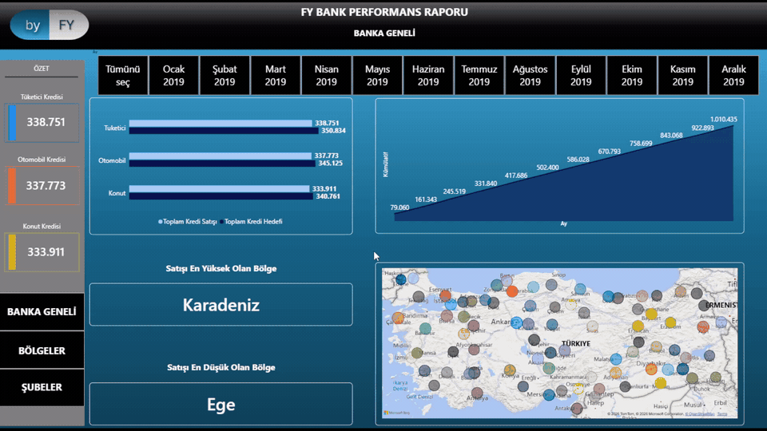
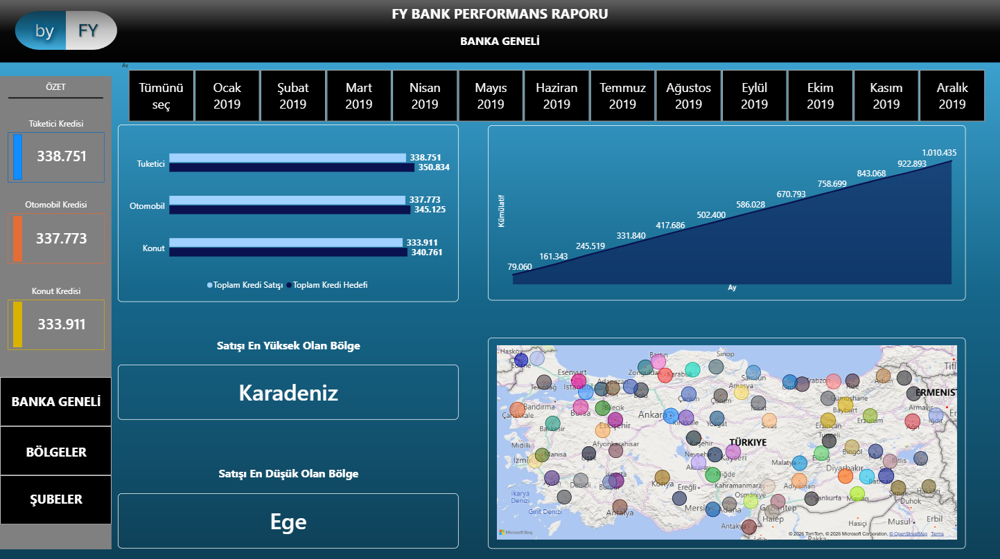
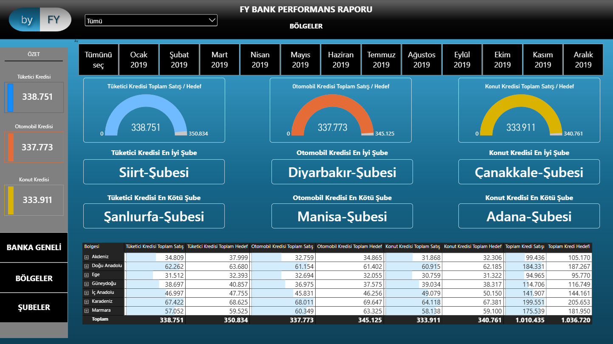
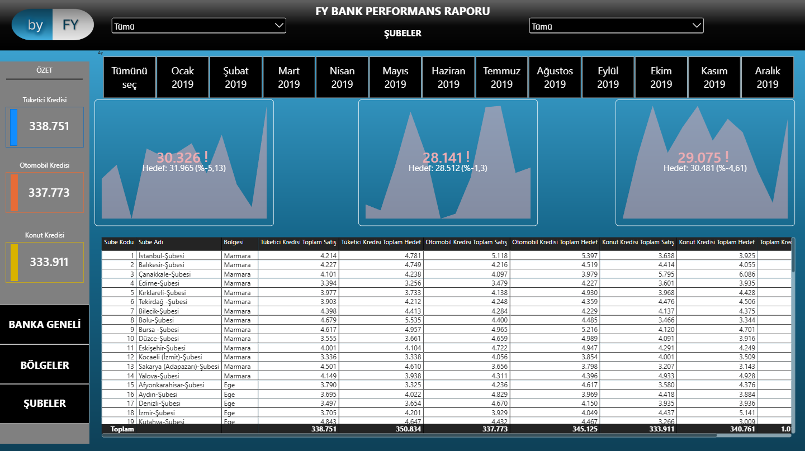

# FY Bank Performance Dashboard

An interactive Power BI dashboard designed to analyze bank loan sales performance across regions and branches.

> **Note:** This is a guided course project created while learning and practicing Power BI. The project was used to apply concepts such as data transformation, DAX measures, interactive filtering, KPI analysis, and dashboard design.

## Dashboard Demo

## Project Overview

The dashboard analyzes the performance of three loan categories:

- Consumer Loans
- Automobile Loans
- Housing Loans

The report compares actual sales against targets and allows performance to be analyzed at bank, regional, and branch levels.

## Report Pages

### Bank Overview

Provides a high-level overview of the bank's overall loan performance, including sales vs. targets, cumulative monthly sales, regional performance, and geographical distribution.

### Regions

Provides a regional breakdown of loan performance, including sales vs. targets and the best and worst performing branches for each loan category.

### Branches

Provides detailed branch-level analysis with individual loan performance indicators and a comprehensive table containing sales and target values for each branch.

## Interactive Features

- Monthly filtering using slicers
- Region and branch filtering
- Dynamic KPIs that respond to filter selections
- Cross-filtering between report visuals
- Navigation between Bank Overview, Regions, and Branches
- Interactive geographical analysis
- Detailed branch-level performance analysis

## Tools & Technologies

- Power BI Desktop
- Power Query
- DAX
- Data Modeling
- Data Visualization

## Key Metrics

The dashboard tracks:

- Total Loan Sales
- Total Loan Targets
- Consumer Loan Sales & Targets
- Automobile Loan Sales & Targets
- Housing Loan Sales & Targets
- Cumulative Sales
- Best and Worst Performing Regions
- Best and Worst Performing Branches

## Project File

The Power BI report file is available in this repository:

`Credit_Analysis.pbix`
